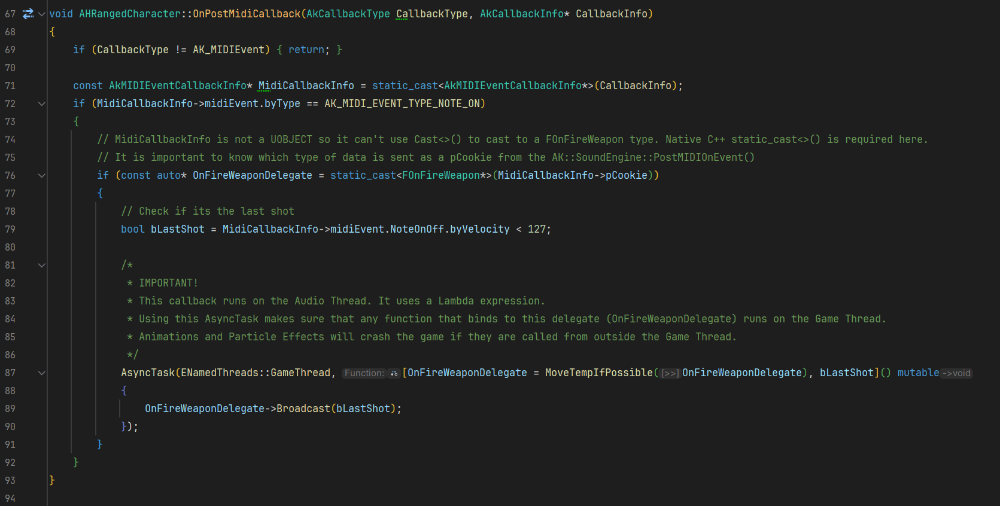
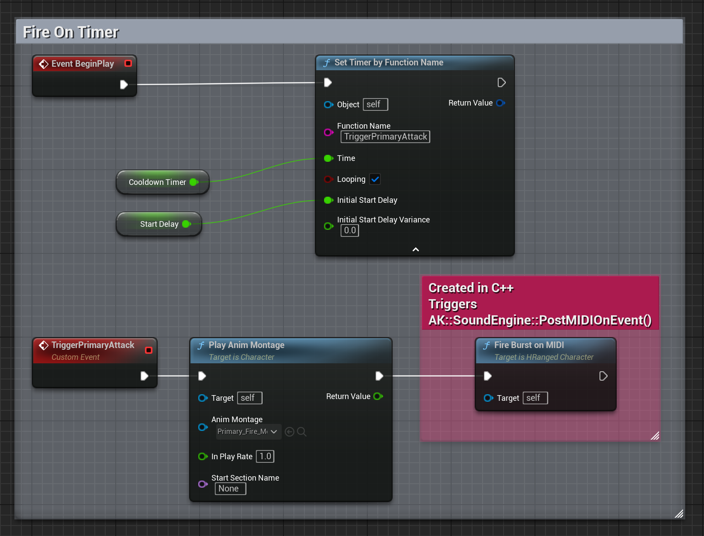

# Post MIDI On Event in Wwise and Unreal Engine
### Game Audio Blog - Above Noise Studios
English: [https://abovenoisestudios.com/blogeng/postmidioneventwwiseueeng](https://abovenoisestudios.com/blogeng/postmidioneventwwiseueeng)\
Spanish: [https://abovenoisestudios.com/blogespanol/postmidioneventwwiseueesp](https://abovenoisestudios.com/blogespanol/postmidioneventwwiseueesp)\
\
Created By: Horacio Valdivieso\
[horacio@abovenoisestudios.com](mailto:horacio@abovenoisestudios.com)\
[LinkedIn](https://www.linkedin.com/in/horaciovaldivieso/)

---
_Unreal Engine Version: **5.3.2**_\
_Wwise Version: **2023.1.0.8367**_

### **English:**
This repository contains an Unreal Engine 5 project, and a Wwise project.
It was created using an empty template in the Epic Games Launcher.\
It uses the [**Paragon: Lt Belica**](https://www.unrealengine.com/marketplace/en-US/product/paragon-lt-belica) character from the Unreal Marketplace\
This project shows how to use the PostMIDIOnEvent function in the Wwise SDK with Unreal Engine to trigger sample-accurate weapon fire shots.

**How to Use?:**\
To download this project, click on the **Code** button and **Download Zip**.\
**The Wwise - Unreal plugin integration is too big for this repository file size limit.**\
Please integrate the Wwise plugin using the Audiokinetic Launcher. Make sure you select the included Wwise Project.\
Please refer to the official documentation: [Integrating Wwise Into Unreal](https://www.audiokinetic.com/en/library/wwise_launcher/?source=InstallGuide&id=integrating_wwise_into_an_unreal_project)

To rebuild and compile the project, ensure you have [Visual Studio](https://visualstudio.microsoft.com/) for Windows or [Xcode](https://download.developer.apple.com/Developer_Tools/Xcode_13.4.1/Xcode_13.4.1.xip) for Mac.
Right-click on **MyUEProject.uproject** and choose **"Generate Visual Studio Project Files"** on Windows or **Services > "Generate Xcode project"** on Mac.
Double-click on **MyUEProject.uproject** to open the UE5 project.

**Rebuild the project:**

**About Compiler Versions:**

WINDOWS:

- _Visual Studio 2019 v16.11.5 to 2022 are currently compatible with UE5_.
- _Its essential to install these Workloads: **".NET Desktop Development"**, **"Desktop Development With C++"**, and **"Game Development With C++"**._\
  **Here is a useful video on how to set up VS for UE5 Development:** [LINK](https://youtu.be/8xJRr6Yr_LU?t=105)

MAC:
- _Xcode v14.1 to 15.2 are currently compatible with UE5_.

Enjoy!

### **Spanish:**
Este repositorio contiene un proyecto en Unreal Engine 5, y un proyecto Wwise.
Fue creado usando una maqueta vacia en el Epic Games Launcher.\
Usa el personaje [**Paragon: Lt Belica**](https://www.unrealengine.com/marketplace/en-US/product/paragon-lt-belica) del Unreal Marketplace\
Este proyecto muestra cómo usar la función PostMIDIOnEvent en el SDK de Wwise con Unreal Engine para disparar armas de tiro sample-accurate.

**Cómo Usar?:**\
Para descargar este proyecto, da click en el botón **Code** y luego en **Download Zip**.\
**El plugin de integración Wwise - Unreal es muy grande para los límites de tamaño de este repositorio.**\
Integra el plugin Wwise usando el Audiokinetic Launcher. Asegúrate de seleccionar el proyecto Wwise incluido en este repositorio.\
Aquí la documentación oficial: [Integrating Wwise Into Unreal](https://www.audiokinetic.com/en/library/wwise_launcher/?source=InstallGuide&id=integrating_wwise_into_an_unreal_project)

Para construir y compilar el proyecto, asegúrate de tener [Visual Studio](https://visualstudio.microsoft.com/) para Windows o [Xcode](https://download.developer.apple.com/Developer_Tools/Xcode_13.4.1/Xcode_13.4.1.xip).
Haz click derecho en **MyUEProject.uproject** y selecciona **"Generate Visual Studio Project Files"** en Windows o **Services > "Generate Xcode project"** en Mac.
Haz doble click en **MyUEProject.uproject** para abrir el proyecto UE5.

**Reconstruye el proyecto:**

**Sobre las versiones del compilador:**

WINDOWS:

- _Visual Studio 2019 v16.11.5 a la 2022 son actualmente compatibles con UE5_.
- _Es esencial instalar estas cargas de trabajo: **".NET Para El Escritorio"**, **"Desarrollo Para El Escritorio Con C++"**, y **"Desarrolo De Juegos Con C++"**._\
  **Aquí hay un vídeo muy útil sobre cómo configurar VS para desarrollo en UE5:** [LINK](https://youtu.be/8xJRr6Yr_LU?t=105)

MAC:

- _Xcode v14.1 a la 15.2 son actualmente compatibles con UE5_.

Disfruta!

## C++ Implementation

## Blueprint Implementation

